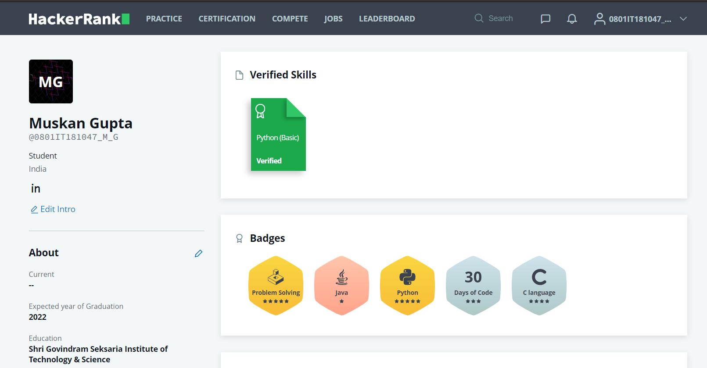

<!-- Main -->

<!-- One -->
<section id="one">
	

		<header class="major">
			<h1>Certifications & Courses</h1>
		</header>

<section id="two" class="spotlights">
	<section>
		<a href="generic.html" class="image">
		
		<!--	-->
		</a>
		

			

				<header class="major">
					<h3>Python for Everybody Specialization</h3>
				</header>
				
This course was conducted by University of Michigan and Coursera under the instructor Dr. Charles Severance. This course started with the fundamentals of programming concepts including Data Structures, networked application program interfaces, and Databases, using the Python programming language.

				<ul class="actions">
					<li><a href="https://www.coursera.org/account/accomplishments/specialization/3LTYY56THPSZ" class="button" target="_blank">View Credential</a></li>
				</ul>
			

		

	</section>
	<section>
		
		

			

				<header class="major">
					<h3>HTML, CSS, and Javascript for Web Developers</h3>
				</header>
				
This course was authorized by Johns Hopkins University and offered through Coursera under the instructor Yaakov Chaikin. It basically reveloved around the fundamentals of web development.

				<ul class="actions">
					<li><a href="https://www.coursera.org/account/accomplishments/verify/YC2K5RTAMJBG" class="button" target="_blank">View Credential</a></li>
				</ul>
			

		

	</section>
		<section>
		
		

			

				<header class="major">
					<h3>SQL Fundamentals</h3>
				</header>
				
It was a course on a technical platform named "Sololearn". The course was on SQL Fundaments.

				<ul class="actions">
					<li><a href="https://www.sololearn.com/Certificate/1060-15457547/pdf/" class="button" target="_blank">View Credential</a></li>
				</ul>
			

		

	</section>
	<section>
		
		

			

				<header class="major">
					<h3>Python</h3>
				</header>
				
Completed assesment on the skill Python on HackerRank

				<ul class="actions">
					<li><a href="https://www.hackerrank.com/certificates/33fae6656caa" class="button" target="_blank">View Credential</a></li>
				</ul>
			

		

	</section>
	<section>
		
		

			

				<header class="major">
					<h3>Microsoft AI Classroom Series</h3>
				</header>
				
It was an Artificial Intelligence classroom series by Microsoft in association with Nasscom and Future Skills. We were introduced to the new world of Azure and learned many new concepts about AI and ML.

				<ul class="actions">
					<li><a href="https://www.linkedin.com/posts/muskan-gupta-336292174_certificate-activity-6730373865207402496-RxOV" class="button">View Credential</a></li>
				</ul>
			

		

	</section>
	<section>
		
		

			

				<header class="major">
					<h3>Gaming Booster</h3>
				</header>
				
GirlScript Ireland organized this interactive 4 weeks workshop called "Gaming Booster". We made flappy_bird and Snake_game using java and p5.js in processing under the guidance of Mentors there.

				<ul class="actions">
					<li><a href="https://www.linkedin.com/posts/muskan-gupta-336292174_certificate-of-girlscript-gaming-booster-activity-6706191734881292289-Z9VS" class="button" target="_blank">View Credential</a></li>
				</ul>
			

		

	</section>
</section>

<!-- Content -->
