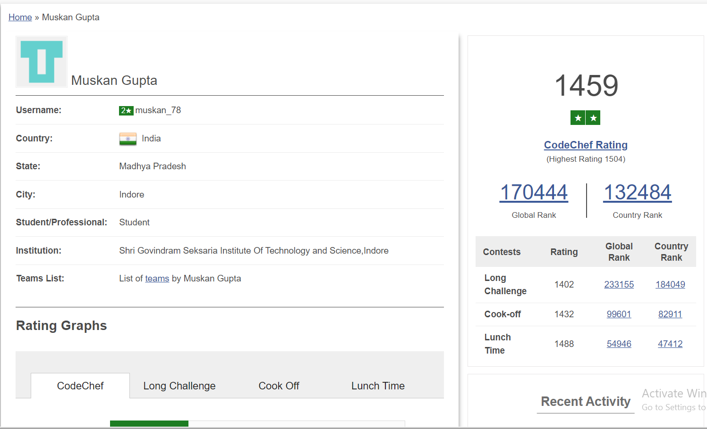
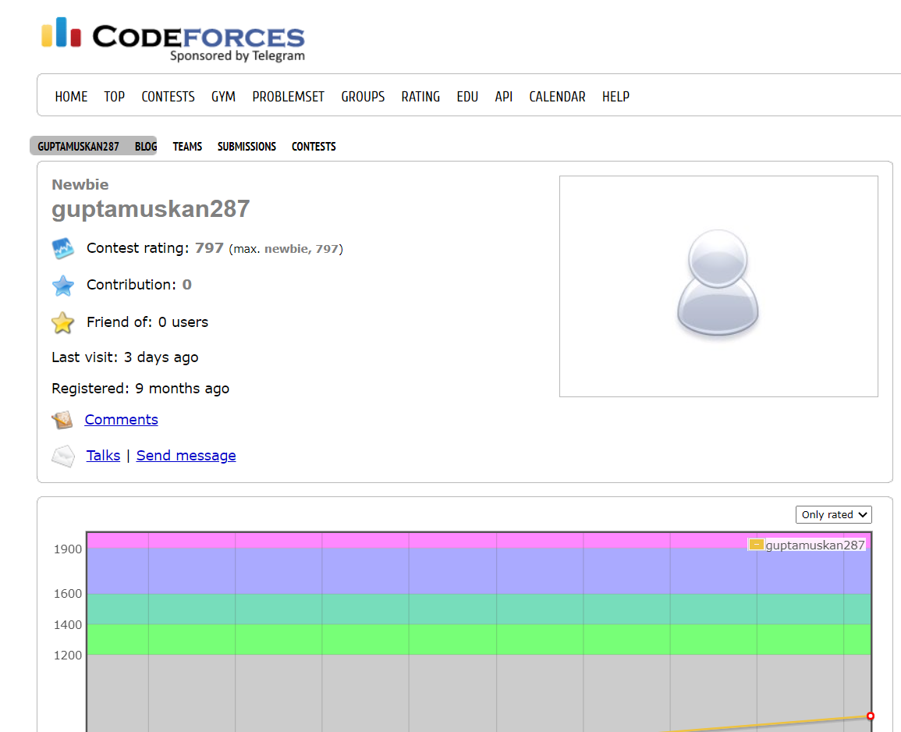

<h2>HackerRank</h2>

<ul class="actions">
					<li><a href="https://www.hackerrank.com/0801IT181047_M_G" target="_blank" class="button">My HACKERRANK Profile</a></li>
				</ul>

<h2>CodeChef</h2>

<ul class="actions">
					<li><a href="https://www.codechef.com/users/muskan_78" target="_blank" class="button">My CODECHEF Profile</a></li>
				</ul>

<h2>HackerRank</h2>

<ul class="actions">
					<li><a href="https://codeforces.com/profile/guptamuskan287" target="_blank" class="button">My CODEFORCES Profile</a></li>
				</ul>